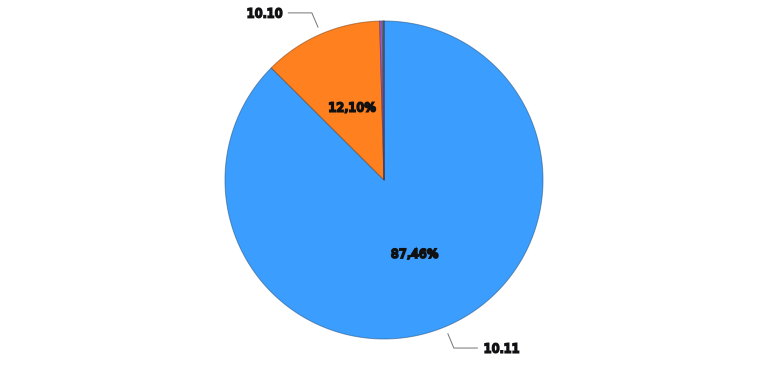
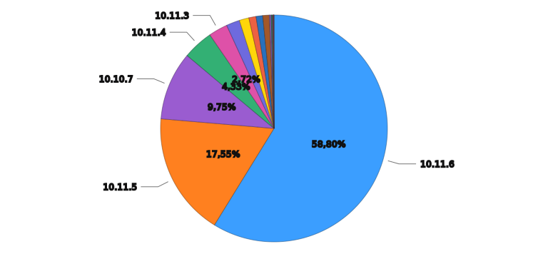
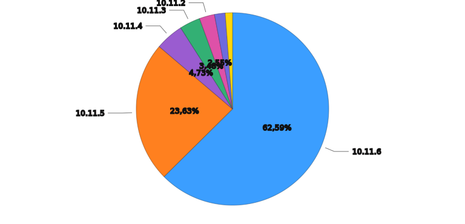
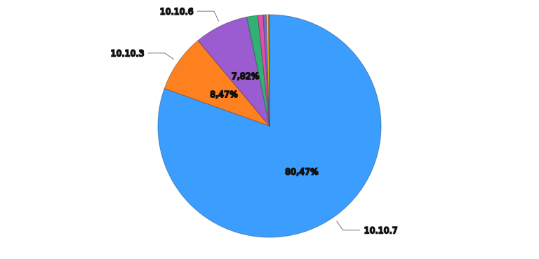

# Axiom Query Results

| Metric | Value |
| ------ | ----- |
| Query Time Range | 2026-02-13T02:07:58Z to 2026-02-14T02:07:58Z |
| Rows Matched | 113,017 |
| Elapsed Time | 384049ms |

## Requests by Jellyfin Server Version

## Requests by Patch Version (10.10, 10.11, 10.12)

## Version 10.11

## Version 10.10

## Summary by Agent

| Agent | Total Count |
| ----- | ----------- |
| Jellyfin-Server/10.12.0 | 227 |
| Jellyfin-Server/10.11.6 | 67,709 |
| Jellyfin-Server/10.11.5 | 18,987 |
| Jellyfin-Server/10.11.4 | 3,658 |
| Jellyfin-Server/10.11.3 | 3,198 |
| Jellyfin-Server/10.11.2 | 2,223 |
| Jellyfin-Server/10.11.1 | 1,136 |
| Jellyfin-Server/10.11.0 | 1,599 |
| Jellyfin-Server/10.10.7 | 11,302 |
| Jellyfin-Server/10.10.6 | 997 |
| Jellyfin-Server/10.10.5 | 249 |
| Jellyfin-Server/10.10.4 | 35 |
| Jellyfin-Server/10.10.3 | 1,266 |
| Jellyfin-Server/10.10.2 | 16 |
| Jellyfin-Server/10.10.1 | 117 |
| Jellyfin-Server/10.10.0 | 57 |
| Jellyfin-Server/10.9.11 | 118 |
| Jellyfin-Server/10.9.10 | 16 |
| Jellyfin-Server/10.9.9 | 14 |
| Jellyfin-Server/10.9.8 | 4 |
| Jellyfin-Server/10.9.7 | 7 |
| Jellyfin-Server/10.9.6 | 8 |
| Jellyfin-Server/10.9.4 | 3 |
| Jellyfin-Server/10.9.3 | 7 |
| Jellyfin-Server/10.9.2 | 3 |
| Jellyfin-Server/10.8.13 | 29 |
| Jellyfin-Server/10.8.12 | 6 |
| Jellyfin-Server/10.8.10 | 13 |
| Jellyfin-Server/10.8.9 | 4 |
| Jellyfin-Server/10.8.8 | 2 |
| Jellyfin-Server/10.8.7 | 1 |
| Jellyfin-Server/10.7.7 | 1 |

---
*Generated at 2026-02-14T02:07:58.987Z*
